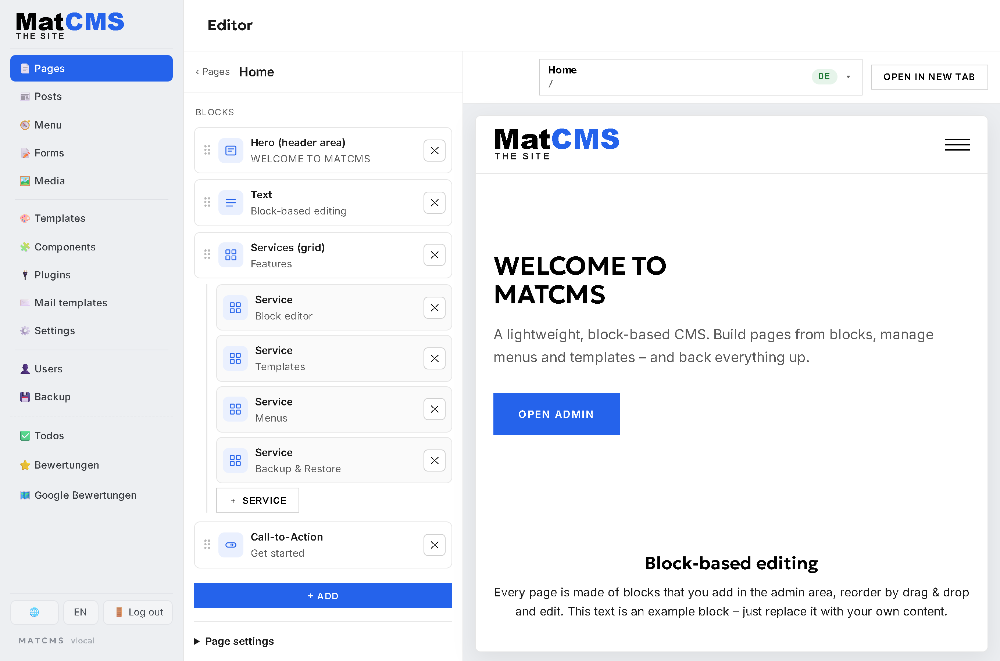
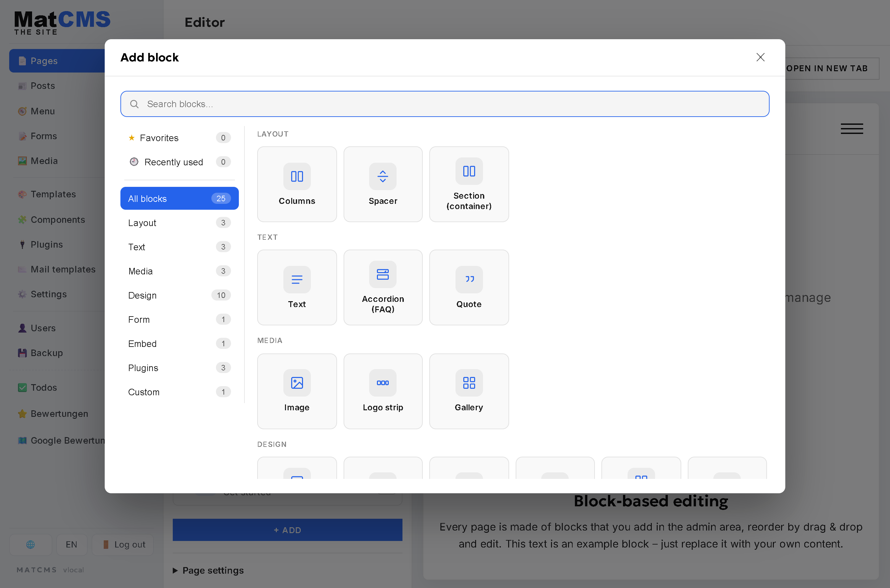
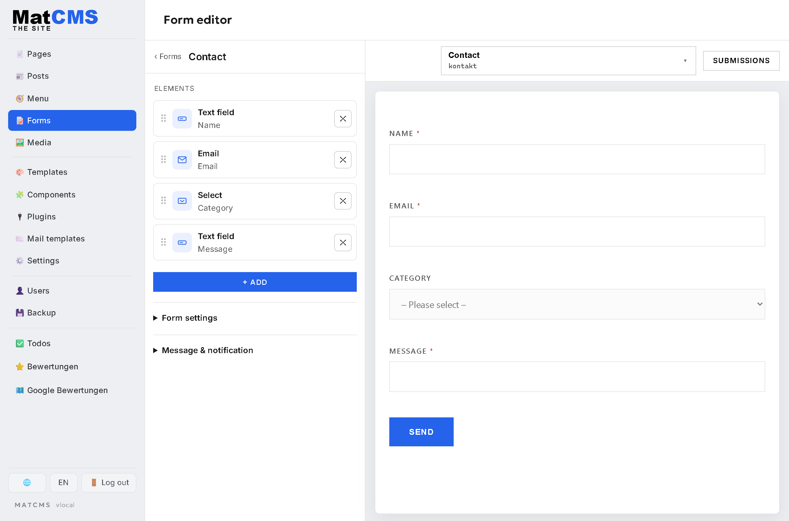
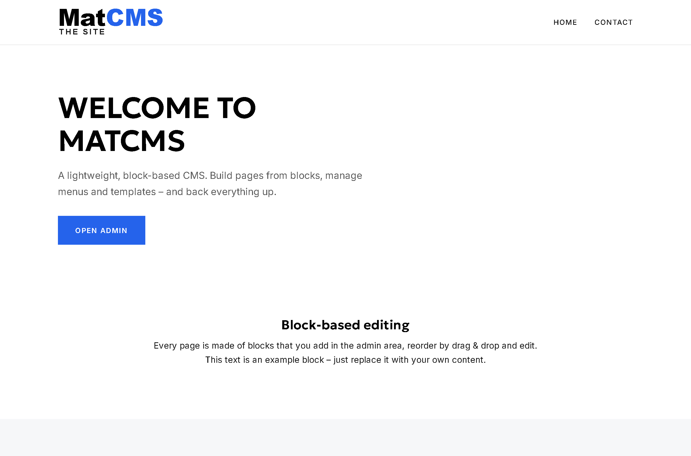
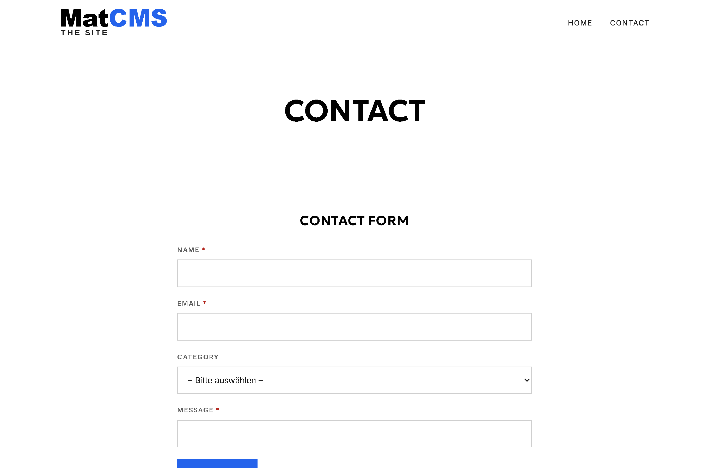
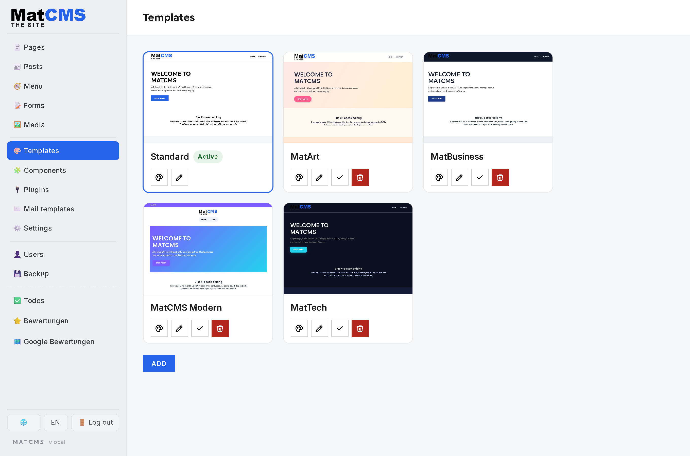
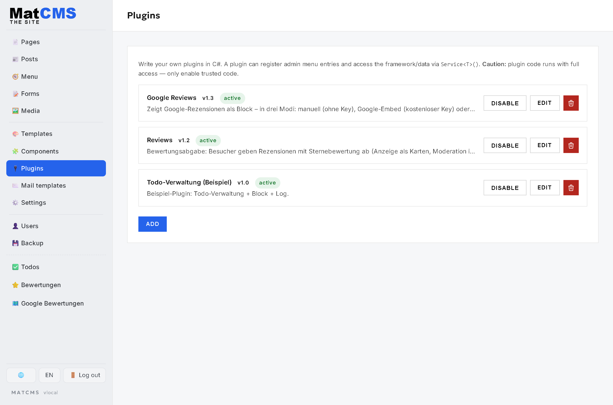
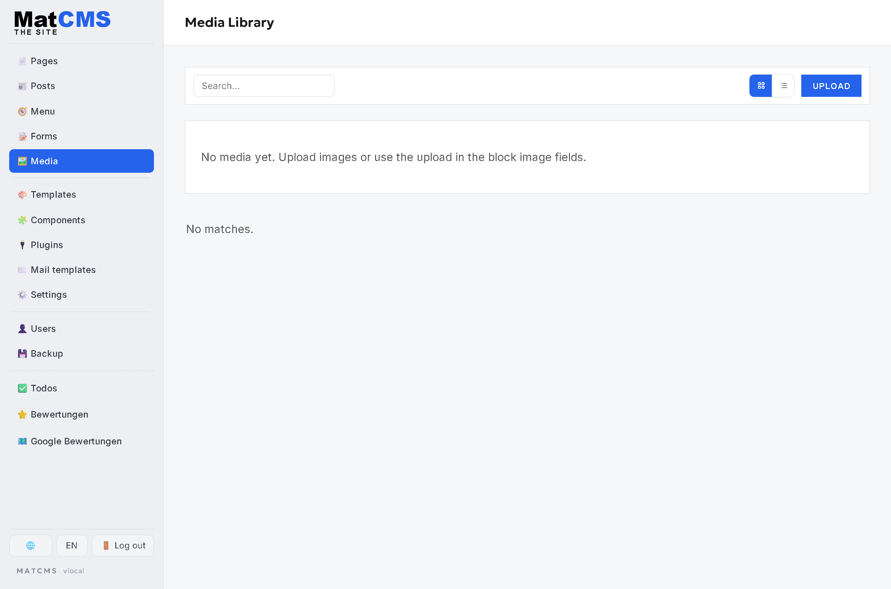
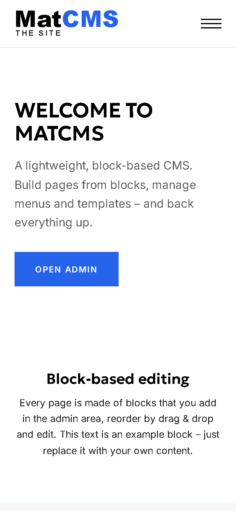
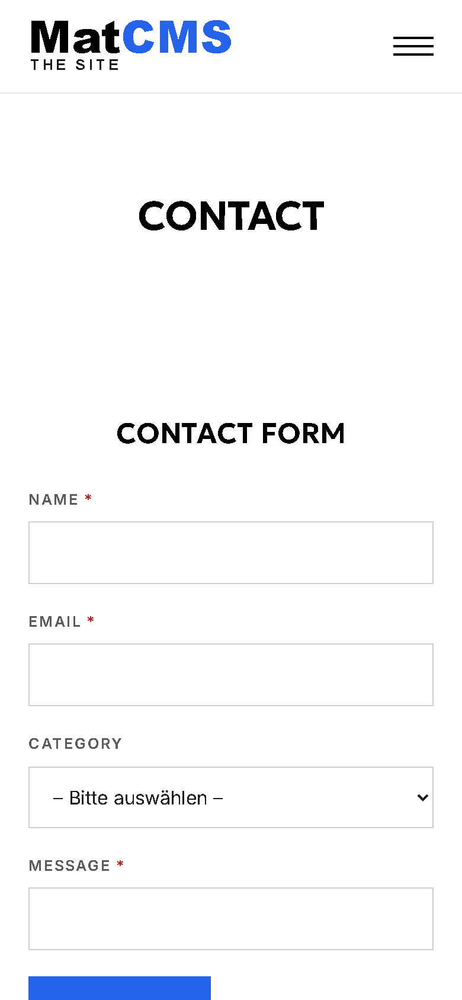

<div align="center">


# MatCMS

**A lightweight, block-based CMS – self-hosted, in a single container.**

Build pages from blocks, manage templates and menus, click forms together, translate across
languages – and back everything up. No cloud lock-in, no third-party services, one SQLite file.

</div>



---

## What this is about

Most content systems are either a database monster with a plugin zoo or a builder that outgrows you
after the first client. MatCMS sits in between: an **ASP.NET Core application in exactly one Docker
container** that assembles a website from **blocks** – with a live preview, templates, plugins, forms
and full multilingual support. One instance = one website; several websites run as several containers
side by side and can be watched and updated centrally from the [cloud control plane](#cloud).

## At a glance

**Pages & content**
- **Block-based editor** with a block list, **drag & drop** and a **real live preview** of the page
- **Categorized block picker** with search, favorites and "recently used" – layout, text, media,
  design, form, embed, plugin and custom blocks
- **Nested blocks** (columns, sections, card grids with child elements)
- **Posts/blog**, menus, a media library and reusable **components**

**Templates & design**
- **Templates** per page type (header/footer/layout parts), maintained in one place
- **Plugins** as blocks written in C# (Roslyn scripting, executed at runtime) – e.g. Google reviews
  with a heading configurable right in the block
- Light/dark appearance, a clean off-canvas layout on narrow screens

**Forms**
- **Visual form builder** with a live preview: text, email, choice, groups, conditions
- **Custom controls**: an image picker with title/tags/description and a **date & date-range picker**
  (two months, flexible "± days") – rendered as a full-screen dialog on mobile
- Every button/field text is adjustable per field and **translatable per language**
- Confirmation message, email notification, submissions in the admin

**Multilingual**
- A separate page/form version **per language** (de/en/hr/sk … driven by `<html lang>`)
- A field-level **translation diff**: what is translated, what is missing, click-to-edit
- Datepicker month names, weekdays and default texts follow the language automatically

**Operations**
- **Backup/restore**: selective export/import (pages, forms, media, settings …)
- Users & roles, mail templates, SMTP
- **One container, one volume** – DB, data-protection keys, uploads and scheduled backups inside it
- Central **update monitoring & remote updates** through the [cloud](#cloud)

## Screenshots

### Block-based editing


Every page is made of blocks. The sortable list (drag & drop) on the left, the real preview on the
right – changes show up immediately.

### Block picker – categorized, with search



Search, categories (layout, text, media, design, form, embed, plugins, custom) plus **favorites** and
**recently used**. Uniform, tidy tiles.

### Form builder



Click elements together and see the result on the right. Alongside the standard fields there are
custom controls like the image picker and the date-range picker – with per-field translatable texts.

### Frontend

| Home page | Contact form |
|---|---|
|  |  |

The public site is built from the same blocks – fast, no layout jank, in light or dark.

### Administration

| Templates | Plugins | Media |
|---|---|---|
|  |  |  |

Templates, plugins, media, components, menus, users, mail templates and backup – all in one
interface, in English **and** German.

### On mobile

| Home page | Form |
|---|---|
|  |  |

## Quick start

Ready-made images are published to the GitHub Container Registry:

| Tag | Built from | Use it for |
|---|---|---|
| `ghcr.io/real-ttx/matcms:latest` | `main` | releases |
| `ghcr.io/real-ttx/matcms:nightly` | `dev` | the newest features |

`docker-compose.yml`:

```yaml
services:
  matcms:
    image: ghcr.io/real-ttx/matcms:latest
    container_name: matcms
    restart: unless-stopped
    ports:
      - "9101:8080"
    volumes:
      - matcms-data:/app/appdata   # DB, keys, uploads, backups – everything lives here

volumes:
  matcms-data:
```

```bash
docker compose up -d
```

Open **http://localhost:9101** and sign in with **`admin` / `admin`**. An update afterwards is just
`docker compose pull && docker compose up -d` – the volume keeps content, settings and keys.

## Cloud

Keep several MatCMS instances in one view: **MatCMS.Cloud** is the control plane for self-hosted
instances. An instance connects to the cloud, and from then on the cloud takes over:

- **Update monitoring** – poll the GHCR registry **once, centrally** instead of in every instance,
  with "update available" per instance
- **Notifications** – email on *instance offline*, *new version* and *failed update*
- **Running updates** – for **local** instances at a click (pull the image, recreate the container
  identically, **roll back** on error); for **remote** ones just the hint plus the command
- **Profiles & sync** – maintain settings, users, plugins and components on profiles and roll them
  out to the assigned instances

→ **Full docs & screenshots: [src/MatCMS.Cloud/README.md](src/MatCMS.Cloud/README.md)**
(image `ghcr.io/real-ttx/matcms-cloud`, port `9100`).

## Monorepo

Two applications, one repo, a shared stack – developed in lockstep:

| Project | What it is | Port | Image |
|---|---|---|---|
| [`src/MatCMS`](src/MatCMS) | The CMS (this README) | 9101 | `ghcr.io/real-ttx/matcms` |
| [`src/MatCMS.Cloud`](src/MatCMS.Cloud) | The control plane | 9100 | `ghcr.io/real-ttx/matcms-cloud` |

Both share a **contract** (`CloudProtocol` ↔ `InstanceProtocol`), the **plugin package format** and
the entire **admin UI** (`site.css`, `admin.css`, shared partials, CodeMirror). In one repo **a single
commit changes both sides** – which is why they were merged. Shared parts move into
`src/MatCMS.Shared` / `src/MatCMS.Shared.Web`.

### Build & run

```bash
cd src/MatCMS       && docker compose up -d --build   # → http://localhost:9101
cd src/MatCMS.Cloud && docker compose up -d --build   # → http://localhost:9100
```

Locally with hot reload (.NET SDK 10):

```bash
cd src/MatCMS       && ./run-dev.ps1
cd src/MatCMS.Cloud && ./run-dev.ps1
```

All projects at once: `dotnet build MatCMS.slnx`.

### Stack

ASP.NET Core 10 · Razor Pages · C# (`net10.0`) · SQLite via EF Core (with migrations) · Docker-first ·
`InvariantGlobalization`. No separate DB container, no Node build chain at runtime.

### CI/CD

Four workflows in `.github/workflows/`, two per application; the **`paths:` filters** make sure a CMS
change does not build a cloud image and vice versa:

| Workflow | Builds | Trigger |
|---|---|---|
| `release.yml` / `dev.yml` | `matcms` | changes under `src/MatCMS/**` |
| `cloud-release.yml` / `cloud-dev.yml` | `matcms-cloud` | changes under `src/MatCMS.Cloud/**` |

Versioning per application: `MAJOR.MINOR` from that project's `VERSION` file, `<build>` from the run
number.
