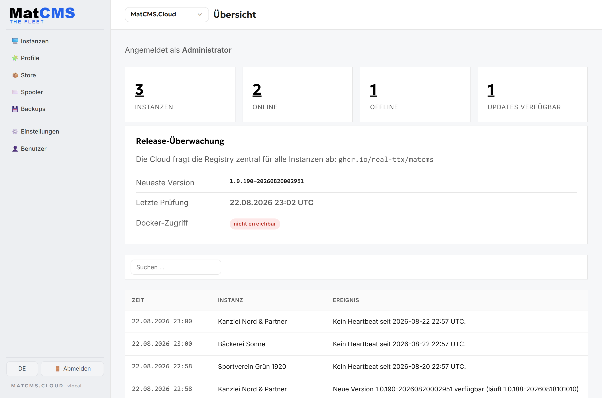
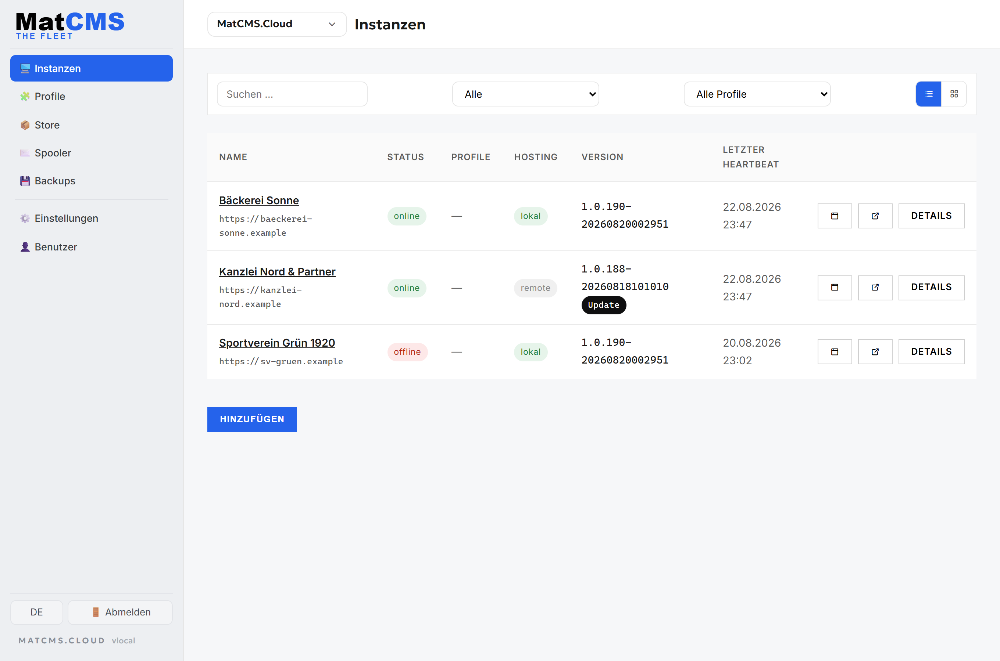
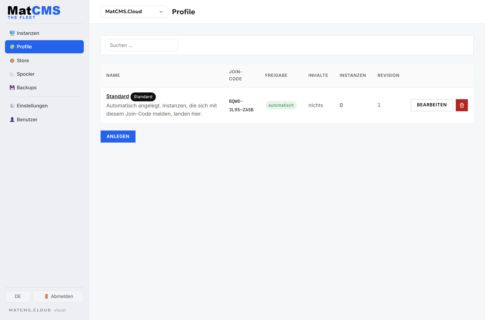
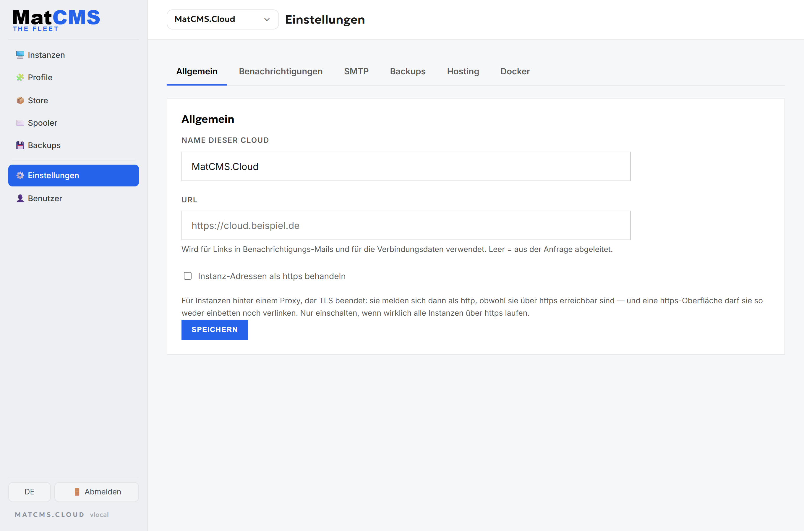

<div align="center">


# MatCMS.Cloud

**Die Control Plane für selbst gehostete MatCMS-Instanzen.**

Alle Websites zentral im Blick: Update-Überwachung, Benachrichtigungen, Fern-Updates mit Rollback
und Profil-Sync – für eine Instanz oder eine ganze Flotte.

</div>



---

**MatCMS.Cloud** ist die zentrale Verwaltung für selbst-gehostete
[MatCMS](https://github.com/Real-TTX/MatCMS)-Installationen. Eine MatCMS-Instanz verbindet sich mit
der Cloud; darüber laufen **Update-Überwachung**, **Benachrichtigungen** und – wo möglich – die
**Ausführung der Updates**, dazu **Profile & Sync** für Einstellungen, Benutzer, Plugins und
Komponenten.

- **Framework:** ASP.NET Core 10 (Razor Pages), C# – identischer Stack wie MatCMS
- **Datenbank:** SQLite (via EF Core) – eine Datei, kein extra DB-Container
- **Auth:** Cookie-basiert, Login **nur** über `/login` (Standard: `admin` / `admin`)
- **Ports:** intern `8080` (Basis-Image-Default), gemappt auf Host `9100`
- **Persistenz:** ein Docker-Volume `matcms-cloud-data` → `/app/appdata` (DB, Keys)

## Screenshots

### Instanzen im Überblick



Alle verbundenen Instanzen mit **Online-/Offline-Status**, *lokal/remote*, gemeldeter Version und dem
letzten Heartbeat. Durchsuchbar, filterbar und wahlweise als Kacheln mit Live-Vorschau; eine Instanz
mit älterem Image bekommt einen **Update**-Hinweis.

### Übersicht & Release-Überwachung


Kennzahlen (Instanzen, online, offline, Updates verfügbar), die **zentrale** GHCR-Release-Prüfung für
alle Instanzen auf einmal und die letzten Ereignisse (offline, neue Version, Sync).

### Profile & Einstellungen

| Profile | Einstellungen |
|---|---|
|  |  |

Profile bündeln Konfiguration (Einstellungen/SMTP, Benutzer, Plugins, Komponenten, Templates) und
rollen sie auf zugeordnete Instanzen aus; die globalen Einstellungen steuern Benachrichtigungen und
Auto-Update.

---

## Funktionsumfang

- **Instanzen** – Verbindung per Join-Code oder Adoption, Heartbeat im Minutentakt, Online-/Offline-Status
  (Dead-Man-Switch nach ~150 s), gemeldete Version, Host, Container und Inhalts-Zahlen, Verlauf je
  Instanz. Die Liste lässt sich durchsuchen und filtern (online/offline, wartet auf Freigabe, Update
  verfügbar, Konfiguration abweichend) und auf **Kacheln mit Live-Vorschau** der Startseiten
  umschalten; jede Instanz hat außerdem einen Vorschau-Tab mit der eingebetteten Website.
- **Update-Überwachung** – die Cloud fragt **einmal zentral** die GitHub Container Registry nach dem
  neuesten `ghcr.io/real-ttx/matcms`-Release ab (alle 30 Minuten) und vergleicht gegen jede Instanz.
  Die Instanzen müssen selbst nicht mehr prüfen.
- **Lokal vs. remote** – die Cloud erkennt selbst, ob eine Instanz auf **demselben Docker-Host**
  läuft: die Instanz meldet ihre Container-ID, die Cloud sucht sie über den gemounteten Docker-Socket.
  Treffer = *lokal*, sonst *remote*. Ein Umzug auf einen anderen Host stuft die Instanz automatisch
  wieder auf *remote* zurück.
- **Updates ausführen** – für **lokale** Instanzen per Klick: neues Image ziehen, Container mit
  identischer Konfiguration (Env, Volumes, Ports, Labels, Netzwerke) neu erstellen, starten – bei
  einem Fehler **Rollback** auf den alten Container. Optional automatisch (Standard: aus).
  Für **remote**-Instanzen nur der Hinweis samt Befehl.
- **Benachrichtigungen** – E-Mail (MailKit/SMTP) bei *Instanz offline*, *neue Version verfügbar* und
  *fehlgeschlagenem Update*. Jeweils **einmal pro Ereignis**, nicht pro Prüfung.
- **Profile & Sync** – Konfiguration (Einstellungen/SMTP, Benutzer, Plugins, Komponenten) wird an
  Profilen gepflegt und auf alle zugeordneten Instanzen ausgerollt; siehe unten.
- **Benutzer** – Cloud-Operatoren mit Login per E-Mail.

Noch nicht gebaut (siehe `CLAUDE.md` → Backlog): eine Vorschau, was ein Sync ändern würde, bevor er
angewendet wird, und das Provisionieren neuer Instanzen über MatOS/Matcad.

---

## Schnellstart mit Docker (empfohlen)

Voraussetzung: Docker Desktop.

```bash
docker compose up -d --build
```

Danach läuft die Oberfläche auf **http://localhost:9100**
Admin-Login: **http://localhost:9100/login** (Benutzer `admin`, Passwort `admin`).

Alternativ das mitgelieferte Skript:

```bash
./run-docker.ps1
```

Nützliche Befehle:

```bash
docker compose logs -f       # Logs ansehen
docker compose down          # stoppen (Daten bleiben im Volume erhalten)
docker compose up -d --build # neu bauen & starten
docker compose down -v       # ZURÜCKSETZEN (löscht das Volume: DB, Keys)
```

### Docker-Socket: optional, aber Voraussetzung fürs Update-Ausführen

`docker-compose.yml` mountet `/var/run/docker.sock`. Nur damit kann die Cloud lokale Instanzen
erkennen **und** aktualisieren. Der Mount ist eine Rechteausweitung (Socket-Zugriff ≙ root auf dem
Host) – wer nur Benachrichtigungen will, entfernt die Zeile; dann gilt jede Instanz als *remote*.
Der Update-Code fasst ausschließlich Container an, deren Image (oder Compose-Projekt) als MatCMS
identifiziert wurde.

Unter Windows/Docker Desktop ist der Endpunkt `npipe://./pipe/docker_engine`
(`MatCmsCloud__Docker__Endpoint`), das setzt `run-dev.ps1` automatisch.

---

## Eine Instanz verbinden

Es gibt zwei Wege, beide unter **Instanzen → Instanz hinzufügen**:

**Weg 1 – die Instanz meldet sich (Join-Code).** Jedes Profil hat einen Join-Code. In MatCMS unter
*Einstellungen → Cloud* die Cloud-URL und den Code eintragen – die Instanz holt sich Zugangsdaten und
Konfiguration selbst. Funktioniert auch hinter NAT, weil die Verbindung ausgehend aufgebaut wird, und
ist der Weg zum Ausrollen vieler Seiten: Der Code hängt am **Profil**, die Instanz landet also
automatisch in der richtigen Gruppe.

**Weg 2 – die Cloud verbindet sich (Adoption).** URL einer bestehenden Instanz plus ein
Administrator-Konto *von dieser Instanz* eingeben. Die Cloud übergibt die Verbindung direkt; die
Instanz prüft die Zugangsdaten gegen ihre eigene Benutzertabelle, bevor sie sie annimmt. Die
Zugangsdaten werden nur für diesen einen Vorgang benutzt und nicht gespeichert. Dafür muss die
Instanz einmal erreichbar sein – danach läuft alles wieder ausgehend.

Ob eine neue Instanz sofort aktiv ist oder erst freigegeben werden muss, steuert der Schalter
**Automatisch freigeben** am Profil.

## Profile

Ein Profil bündelt Regeln und Konfiguration für die zugeordneten Instanzen:

- **Regeln** – Benachrichtigungen, Empfänger, automatisches Update lokaler Instanzen. Ohne Profil
  gelten die globalen Einstellungen.
- **Einstellungen** – SMTP-Block plus beliebige weitere MatCMS-Einstellungsschlüssel.
- **Benutzer** – Konten, die auf den Instanzen angelegt werden. Das Passwort wird einmal in der Cloud
  gehasht; im Klartext wird es nirgends gespeichert.
- **Plugins** – Plugin-Pakete, wie MatCMS sie exportiert. Gleicher Schlüssel = Aktualisierung.
  Ein hochgeladenes Paket lässt sich hier **direkt bearbeiten** (Name, Version, Beschreibung, C#-Code);
  beim Speichern wird es neu gepackt, mitgelieferte Dateien bleiben unverändert.
- **Komponenten** – wiederverwendbare Blöcke, identifiziert über ihren Typ. Der Editor ist derselbe
  wie in MatCMS: Felder anklicken statt JSON tippen, Testdaten eingeben, **Live-Vorschau** des
  gerenderten Blocks, plus ein Debug-Panel, das Platzhalter ohne passendes Feld anzeigt.
- **Templates** – komplette Designs samt Layout-HTML, CSS, JS, Parametern und Layout-Teilen, mit
  **Live-Vorschau**: eine Beispielseite, die sich beim Tippen mitverändert, Farbwähler für alle
  Farbwerte und CodeMirror für HTML/CSS/JS. Nicht aufgelöste `{{platzhalter}}` werden in der Vorschau
  rot markiert. Am schnellsten geht es so: Template in MatCMS fertig bauen, dort unter *Templates →
  Template öffnen → „Als JSON exportieren"* herunterladen und hier im Profil einfügen. Welches
  Template auf den Instanzen **aktiv** wird, ist ein eigener Schalter – leer bedeutet, dass die
  Instanz ihre Wahl behält. Die vom Kunden gesetzten Template-Parameter werden nicht überschrieben.

Jede Änderung erhöht die **Revision** des Profils. Die Instanzen sehen sie im Heartbeat, holen sich
die neue Konfiguration und melden zurück, welche Revision sie angewendet haben – daraus entsteht die
Anzeige *synchron / abweichend / Fehler* je Instanz.

Pro Nutzlast lässt sich einstellen, ob die Cloud **überschreibt** (Instanz wird angeglichen) oder nur
**ergänzt** (nur Fehlendes wird angelegt). Drei Regeln gelten dabei immer:

1. **Benutzer werden nur ergänzt** – bestehende Konten werden nie geändert oder gelöscht. Sonst
   könnte man sich über eine Cloud-Einstellung aus der eigenen Seite aussperren.
2. **Nichts wird gelöscht**, nur weil es nicht mehr im Profil steht. Ein Plugin aus dem Profil zu
   nehmen stoppt künftige Rollouts, entfernt es aber nicht von laufenden Seiten.
3. **Importierte Plugins bleiben deaktiviert** – Plugin-Code läuft serverseitig, das schaltet ein
   Mensch auf der Instanz frei.

In MatCMS liegt die Gegenseite unter *Einstellungen → Cloud*. Die API dahinter:
`POST /api/instances/{id}/heartbeat` mit dem Header `X-MatCMS-Instance-Token`.

> **Damit „lokal" erkannt wird**, muss die Instanz ihre Container-ID melden – das passiert
> automatisch aus `/proc/self/cgroup` bzw. `/proc/self/mountinfo`. Optional kann per Umgebungs-
> variable `MATCMS_IMAGE` das eigene Image gemeldet werden (nur zur Anzeige).

---

## CI/CD & Versionierung

Zwei GitHub-Actions-Workflows bauen das Docker-Image und pushen es in die
**GitHub Container Registry (GHCR)** unter `ghcr.io/<owner>/matcms-cloud`
(der `<owner>` wird kleingeschrieben). Im Monorepo lösen sie nur bei Änderungen unter
`src/MatCMS.Cloud/**` aus (`paths:`-Filter), bauen also kein CMS-Image mit.

| Branch / Kontext | Workflow                              | Version                                | `:latest`? |
|------------------|---------------------------------------|----------------------------------------|:----------:|
| `main` (Release) | `.github/workflows/cloud-release.yml` | `MAJOR.MINOR.<build>-<datetime>`       | ja         |
| `dev` (Nightly)  | `.github/workflows/cloud-dev.yml`     | `nightly-<build>-<datetime>`           | nein       |
| lokal            | (Dockerfile-Default)                  | `local-<datetime>` (manuell empfohlen) | –          |

- `MAJOR.MINOR` kommt aus der Datei **`VERSION`** im Projektordner `src/MatCMS.Cloud` (Default `1.0`).
- `<build>` = `github.run_number`, `<datetime>` = UTC `yyyyMMddHHmmss`.
- Die berechnete Version wird als Build-Arg **`APP_VERSION`** übergeben und als
  `InformationalVersion` hinterlegt.

---

## Lokale Entwicklung (Hot Reload)

Voraussetzung: .NET SDK 10.

```bash
./run-dev.ps1
```

bzw. manuell:

```bash
dotnet restore
dotnet watch run
```

Läuft ebenfalls auf **http://localhost:9100**.

---

## Projektstruktur

```
MatCMS.Cloud/
├─ Program.cs                  # Startup, DI, Auth, Rate-Limits, Instanz-API (Heartbeat/Disconnect)
├─ Data/                       # EF Core DbContext + DbSeeder
├─ Models/                     # Instance, InstanceEvent, User, CloudSetting
├─ Services/
│  ├─ InstanceService.cs       # Pairing, Token-Auth, Heartbeat, lokal/remote-Klassifizierung
│  ├─ InstanceProtocol.cs      # Wire-Contract (HeartbeatRequest/Response) + Protokoll-Version
│  ├─ DockerHostService.cs     # Container finden + Update ausführen (Docker.DotNet)
│  ├─ GhcrClient.cs            # GHCR-Tag-Abfrage + Versionsvergleich
│  ├─ ReleaseWatcher.cs        # zentraler Release-Poll (30 min) als Singleton-Cache
│  ├─ InstanceMonitorService.cs# Watchdog: offline, Update-Hinweis, Auto-Update
│  ├─ EmailService.cs          # SMTP via MailKit (465 implizit SSL + 587 STARTTLS)
│  └─ …                        # Auth, CloudContext, Localizer, SettingKeys, VersionService
├─ Resources/                  # i18n-Strings der Oberfläche (de.json / en.json)
├─ Pages/
│  ├─ Login / Logout / Error
│  ├─ Shared/_AdminLayout.cshtml
│  └─ Admin/                   # Übersicht, Instanzen, Einstellungen, Benutzer
├─ wwwroot/                    # site.css + admin.css (aus MatCMS), cloud.css, Tabler-Icons
├─ Dockerfile / docker-compose.yml
├─ VERSION                     # MAJOR.MINOR für die CI-Versionierung
└─ appdata/                    # Laufzeitdaten: SQLite-DB, Keys (Volume, gitignored)
```

### Daten & Persistenz

- SQLite-DB (`appdata/matcmscloud.db`) und Data-Protection-Keys liegen im **einen** Volume
  `matcms-cloud-data` (`/app/appdata`).
- Das Schema wird beim Start per **EF-Core-Migration** (`db.Database.Migrate()`) angelegt und
  fortgeschrieben — Schema-Änderungen kommen als Migration ins Repo, ein Volume-Reset ist dafür
  nicht nötig (genau wie bei MatCMS).

---

## Sicherheitshinweise

- **Standard-Zugang `admin` / `admin` nach dem ersten Start ändern.**
- Für den öffentlichen Betrieb hinter einen **Reverse-Proxy mit HTTPS** stellen. Der Container
  spricht intern HTTP auf 8080; Host-Port 9100 kommt nur aus dem Compose-Mapping.
- **Login-Schutz:** `/login` ist pro Client-IP ratenbegrenzt (10/min), die Instanz-API auf 120/min.
  Hinter einem Reverse-Proxy `ForwardedHeaders` aktivieren, damit die echte Client-IP zählt.
- **Instanz-Token** werden nur als SHA-256-Hash gespeichert und beim Vergleich zeitkonstant geprüft.
- **Der Docker-Socket ist der kritischste Teil.** Nur mounten, wenn die Cloud Updates ausführen soll.
